# TriProtocol Benchmark

A comprehensive protocol serialization benchmark and validation server that supports three different serialization formats: **String**, **JSON**, and **Protocol Buffers**. This project provides both a terminal user interface (TUI) for interactive testing and a REST API for programmatic access.

## 🚀 Features

- **Multi-Protocol Support**: Test and compare three serialization protocols
  - String-based serialization
  - JSON serialization
  - Protocol Buffers (protobuf) binary serialization
- **Layered Architecture**: Clean separation between Transport and Presentation layers
  - **Transport Layer**: Pluggable RoundTripper interface (TCP/UDP)
  - **Presentation Layer**: Generic Serde interface for multiple serialization formats
- **Interactive TUI**: Beautiful terminal interface built with [Bubble Tea](https://github.com/charmbracelet/bubbletea)
- **Universal Domain Model**: Single set of domain entities work with all serializers
- **Observability**: OpenTelemetry instrumentation for tracing and metrics
- **Validation**: Request/response validation with comprehensive error handling
- **Python Client Scripts**: Ready-to-use Python scripts for testing different protocols

## 📋 Table of Contents

- [Requirements](#requirements)
- [Installation](#installation)
- [Usage](#usage)
  - [Running the Server](#running-the-server)
  - [Using the TUI](#using-the-tui)
  - [Using Python Clients](#using-python-clients)
- [Architecture](#architecture)
- [Development](#development)
- [Docker](#docker)
- [Project Structure](#project-structure)
- [License](#license)

## � Quick Start with Docker

Want to try the app immediately without cloning the repository? Run it directly using Docker:

```bash
docker run --rm --pull always -it ghcr.io/taldoflemis/triprotocol-benchmark/tui:latest
```

This command will:

- Pull the latest image from GitHub Container Registry
- Run the interactive TUI (Terminal User Interface)
- Automatically remove the container when you exit
- Always fetch the latest version

**Note**: The TUI requires an interactive terminal (`-it` flags). For headless server mode, use:

```bash
docker run -it --pull always ghcr.io/taldoflemis/triprotocol-benchmark/tui:latest
```

## �🛠️ Requirements

- Go 1.24.5 or higher
- Protocol Buffers compiler (`protoc`)
- Python 3.x (for client scripts)
- Docker (optional, for containerized deployment)

## 📦 Installation

1. **Clone the repository**

```bash
git clone https://github.com/taldoflemis/triprotocol-benchmark.git
cd triprotocol-benchmark
```

2. **Install Go dependencies**

```bash
go mod download
```

3. **Generate Protocol Buffer code**

```bash
# For Go
task proto:gen

# For Python
task proto:gen-python
```

## 🎮 Usage

### Running the Server

The application can be run in different modes:

```bash
# Run with default settings
go run .
```

### Using the TUI

The Terminal User Interface provides an interactive way to test the serialization protocols:

1. Launch the TUI:

```bash
go run .
```

2. Navigate through the interface using:

   - **Tab**: Switch between input fields
   - **Enter**: Submit requests
   - **Arrow keys**: Navigate through results
   - **Ctrl+C**: Exit the application

3. Select a protocol (String, JSON, or Protobuf) and perform operations like:
   - Authentication
   - Operations with parameters
   - Information queries
   - Logout

### Using Python Clients

The project includes Python scripts for testing each protocol:

**Protocol Buffers Client:**

```bash
cd scripts
python3 proto_requests.py
```

**JSON Client:**

```bash
python3 json_requests.py
```

**String Protocol Client:**

```bash
python3 string_request.py
```

## 🏗️ Architecture

### Prerequisites

Install Task runner (optional but recommended):

```bash
go install github.com/go-task/task/v3/cmd/task@latest
```

### Available Tasks

```bash
# Generate Go code from proto files
task proto:gen

# Generate Python code from proto files
task proto:gen-python
```

### Running Tests

```bash
# Run all tests
go test ./...

# Run tests with coverage
go test -cover ./...

# Run specific test
go test -v -run TestJSONSerde
```

### Debug Mode

The project includes a debug configuration for Delve:

```bash
# Run headless debugger
task "Run Headless DLV"

# Or manually
dlv debug --headless --listen=:2345 --api-version=2 ./main.go
```

## 🐳 Docker

### Building the Image

```bash
docker build -t triprotocol-benchmark .
```

### Running the Container

```bash
docker run -p 8080:8080 triprotocol-benchmark
```

The Dockerfile uses multi-stage builds for optimal image size and security:

- Builder stage with Go 1.25.3
- Final stage using scratch image
- Non-root user execution
- SSL certificates included

## 📁 Project Structure

```
.
├── main.go                 # Application entry point
├── tui.go                  # Terminal UI implementation
├── app_layer.go            # Application layer with generic client
├── round_tripper.go        # Transport layer abstraction (TCP/UDP)
├── domain.go               # Domain models and types
├── dto.go                  # Data transfer objects
├── serde.go                # Presentation layer serialization interface
├── string_serde.go         # String protocol implementation
├── json_serde.go           # JSON protocol implementation
├── protobuf_serde.go       # Protobuf protocol implementation
├── error.go                # Error handling
├── settings.go             # Configuration management
├── theme.go                # TUI theming
├── proto/
│   └── triprotocol.proto   # Protocol Buffer definitions
├── protogenerated/         # Generated protobuf code
├── scripts/                # Python client scripts
│   ├── proto_requests.py   # Protobuf client
│   ├── json_requests.py    # JSON client
│   └── string_request.py   # String protocol client
├── Dockerfile              # Container definition
├── Taskfile.yaml           # Task automation
└── base.yaml               # Base configuration
```

## 🏗️ Architecture

This project implements a clean separation of concerns by abstracting two critical layers of the network stack:

### Layer Abstraction Overview


### 1. Transport Layer Abstraction

The **RoundTripper** interface abstracts the transport protocol (TCP/UDP):


**Key Benefits:**

- Swap between TCP and UDP without changing application logic
- Easy to add new transport protocols (HTTP/3, QUIC, etc.)
- Centralized timeout and connection management

### 2. Presentation Layer Abstraction

The **Serde** interface handles serialization/deserialization, translating between domain entities and protocol-specific formats:


**Key Benefits:**

- Single domain model works with all serialization formats
- Add new formats without touching business logic
- Protocol-agnostic application code

### 3. Request Flow Architecture

```mermaid
sequenceDiagram
    participant Client as Client Code
    participant AppLayer as AppLayerClient
    participant Serde as Serde Implementation
    participant RT as RoundTripper
    participant Server as Remote Server

    Client->>AppLayer: Do(ctx, address, request, token)
    AppLayer->>AppLayer: Wrap in PresentationLayerRequest
    AppLayer->>Serde: Marshal(request)
    Serde->>Serde: Convert Domain → Protocol Format
    Serde-->>AppLayer: []byte (serialized)
    AppLayer->>RT: RequestReply(ctx, address, bytes)
    RT->>Server: Send via TCP/UDP
    Server-->>RT: Response bytes
    RT-->>AppLayer: []byte (response)
    AppLayer->>Serde: Unmarshal(bytes, response)
    Serde->>Serde: Convert Protocol Format → Domain
    Serde-->>AppLayer: Populated response object
    AppLayer-->>Client: Response / Error
```



### 4. Universal Serializer Pattern

All three serializers work with the **same domain entities** through a generic pattern:


**Example Domain Entity Usage:**

```go
// Same domain entity for all serializers
authReq := &AuthRequest{
    StudentID: "538349",
    Timestamp: time.Now(),
}

// Works with String serializer
stringClient := NewAppLayerClient[OperationRequest, OperationResponse](
    &StringSerde{},
    &TCPRoundTripper{},
    settings,
)

// Works with JSON serializer
jsonClient := NewAppLayerClient[OperationRequest, OperationResponse](
    &JSONSerde{},
    &TCPRoundTripper{},
    settings,
)

// Works with Protobuf serializer
protoClient := NewAppLayerClient[OperationRequest, OperationResponse](
    &ProtobufSerde{},
    &TCPRoundTripper{},
    settings,
)

// All use the same interface!
response, err := client.Auth(ctx, address, authReq)
```

## 🔑 Key Components

### Serialization Formats

1. **String Protocol**: Simple string-based format for lightweight communication
2. **JSON**: Human-readable JSON format with UTF-8 encoding
3. **Protocol Buffers**: Binary serialization for efficient network transmission

### Core Features

- **Validation**: Request validation using `go-playground/validator`
- **Observability**: OpenTelemetry integration for distributed tracing
- **Configuration**: Flexible configuration with Viper
- **Type Safety**: Generic AppLayerClient with compile-time type checking

## 🤝 Contributing

Contributions are welcome! Please feel free to submit a Pull Request.

## 📝 License

This project is licensed under the MIT License - see the LICENSE file for details.

## 👥 Authors

- Taldo Flemis ([@taldoflemis](https://github.com/taldoflemis))

## 🙏 Acknowledgments

- [Bubble Tea](https://github.com/charmbracelet/bubbletea) - Terminal UI framework
- [Echo](https://echo.labstack.com/) - High performance HTTP framework
- [Protocol Buffers](https://protobuf.dev/) - Google's data interchange format
- [OpenTelemetry](https://opentelemetry.io/) - Observability framework

---

**Note**: This is a benchmark and educational project designed to demonstrate and compare different serialization protocols in distributed systems.
